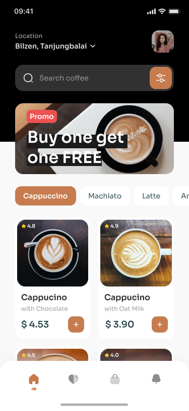
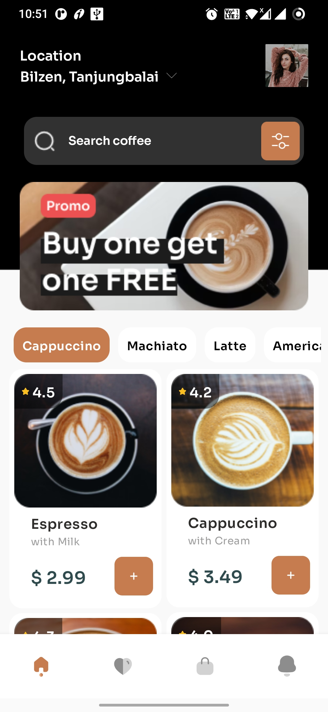

# Jetpack-Compose-UI-Playground

Just me practising Jetpack Compose

<table>
    <tr>
      <th></th>
      <th>Design</th>
      <th>Implementation</th>
      <th>Design Credits</th>
    </tr>
    <tr>
      <td>1</td>
      <td></td>
      <td></td>
      <td> <a href="https://www.figma.com/community/file/1116708627748807811/coffee-shop-mobile-app-design">
        Figma Link
      </a></td>
    </tr>
  </table>
